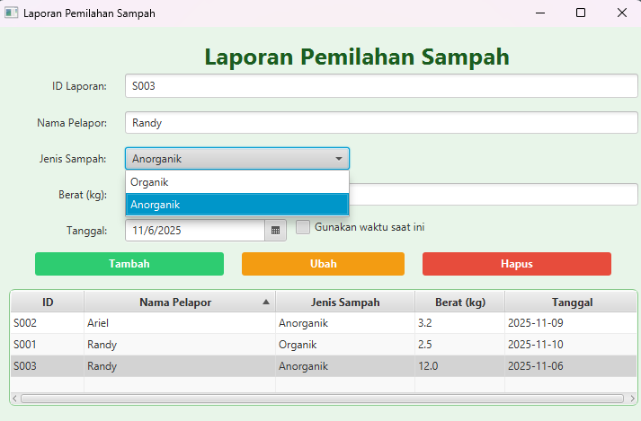

# 🗑️ Laporan Pemilah Sampah  
**Tugas Pemrograman Lanjut Pertemuan 11**  
**Muhammad Randy Kurniawan**  
**MKB 3B | NIM: 2405315**  
**Simple JavaFX App — Laporan Pemilah Sampah**

---

## 🇮🇩 Deskripsi Proyek
Aplikasi ini merupakan tugas individu untuk mengimplementasikan **konsep Model-View-Controller (MVC)** dalam JavaFX tanpa menggunakan database.  
Tema yang diambil adalah **Laporan Pemilah Sampah**, yang memungkinkan pengguna untuk mencatat, mengubah, dan menghapus data sampah harian berdasarkan jenisnya.

### 🎯 Tujuan
- Melatih pemahaman tentang arsitektur **MVC** di JavaFX.  
- Mengimplementasikan operasi **CRUD (Create, Read, Update, Delete)** tanpa basis data.  
- Menggunakan **komponen tambahan** seperti `DatePicker`, `CheckBox`, dan `ComboBox`.  
- Membuat antarmuka yang sederhana, bersih, dan responsif.

---

## 🧩 Struktur Proyek (MVC)
```bash
src/
├── controller/
│   └── SampahController.java   # Logika dan event handling
├── model/
│   └── SampahModel.java        # Struktur data Sampah
├── view/
│   └── SampahView.fxml         # Tampilan GUI menggunakan JavaFX
└── Main.java                   # Entry point aplikasi
```

---

## 🧠 Fitur Utama
- **Tambah Data (Create):** Menambahkan laporan baru ke tabel.  
- **Lihat Data (Read):** Menampilkan seluruh daftar laporan sampah.  
- **Ubah Data (Update):** Mengubah data yang telah dipilih dari tabel.  
- **Hapus Data (Delete):** Menghapus laporan yang dipilih dari tabel.  
- **Tipe Sampah:** Pilihan `Organik` atau `Anorganik`.  
- **Tanggal Otomatis:** Centang opsi *Gunakan Tanggal Sekarang* untuk mengisi tanggal otomatis.  
- **Notifikasi:** Menggunakan `Alert` popup untuk setiap aksi CRUD.  
- **Tanpa Database:** Data tersimpan sementara di `ObservableList`.

---

## 🧱 Komponen UI
| Komponen | Fungsi |
|-----------|--------|
| `TextField` | Input ID, Nama, Berat |
| `ComboBox` | Memilih jenis sampah (Organik/Anorganik) |
| `DatePicker` | Memilih tanggal pelaporan |
| `CheckBox` | Opsi untuk tanggal otomatis |
| `TableView` | Menampilkan seluruh data |
| `Button` | Tombol Tambah, Ubah, dan Hapus |

---

## 🧍 Contoh Data Awal (Dummy)
| ID | Nama | Jenis | Berat (kg) | Tanggal |
|----|------|--------|-------------|----------|
| S001 | Randy | Organik | 2.5 | 2025-11-10 |
| S002 | Ariel | Anorganik | 3.2 | 2025-11-09 |

---

## ⚙️ Cara Menjalankan Proyek
1. Pastikan sudah menginstal **JDK 17+** dan **JavaFX SDK**.
2. Clone repositori ini:
   ```bash
   git clone https://github.com/username/laporan-pemilah-sampah.git
   ```
3. Buka project di **Apache NetBeans**, **IntelliJ IDEA**, atau **VSCode** dengan dukungan JavaFX.
4. Jalankan file utama:
   ```bash
   Main.java
   ```
5. Aplikasi siap digunakan 🎉

---

## 🧑‍💻 Tentang Pengembang
**Nama:** Muhammad Randy Kurniawan  
**Program Studi:** Mechatronics & Artificial Intelligence (MKB)  
**Universitas:** Universitas Pendidikan Indonesia, Kampus Purwakarta  
**Fokus:** Back End Developer & JavaFX Desktop Application Developer

---

## 🇬🇧 English Version

### Project Description
This is a **JavaFX MVC application** developed as part of the *Advanced Programming (Pemrograman Lanjut)* course.  
The project is titled **“Waste Sorting Report”**, designed to help users record, update, and manage waste data without using a database.

### Key Features
- **CRUD Operations:** Create, Read, Update, Delete waste records.  
- **Waste Type Selection:** Choose between *Organic* and *Inorganic*.  
- **Automatic Date Input:** Option to auto-fill the current date.  
- **UI Alerts:** Popup notifications for every operation.  
- **Lightweight & Offline:** Uses `ObservableList` instead of a database.  

### Dummy Data
| ID | Name | Type | Weight (kg) | Date |
|----|------|------|--------------|------|
| S001 | Randy | Organic | 2.5 | 2025-11-10 |
| S002 | Ariel | Inorganic | 3.2 | 2025-11-09 |

### How to Run
1. Install **JDK 17 or later** and **JavaFX SDK**.
2. Clone this repository:
   ```bash
   git clone https://github.com/username/waste-sorting-report.git
   ```
3. Run the `Main.java` file in your IDE.
4. Enjoy using the app 🎉

---

## 🖼️ Preview Screenshot
Tambahkan tangkapan layar aplikasi di bawah ini untuk dokumentasi GitHub Anda:





---

## 🧾 Lisensi
Proyek ini dibuat untuk keperluan akademik.  
Feel free to fork and modify — just include credit to the original author.

---

**© 2025 Muhammad Randy Kurniawan — Universitas Pendidikan Indonesia (UPI) Purwakarta**
